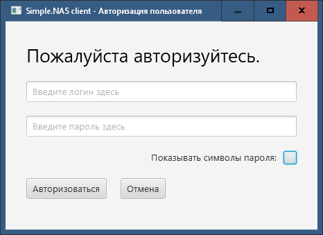
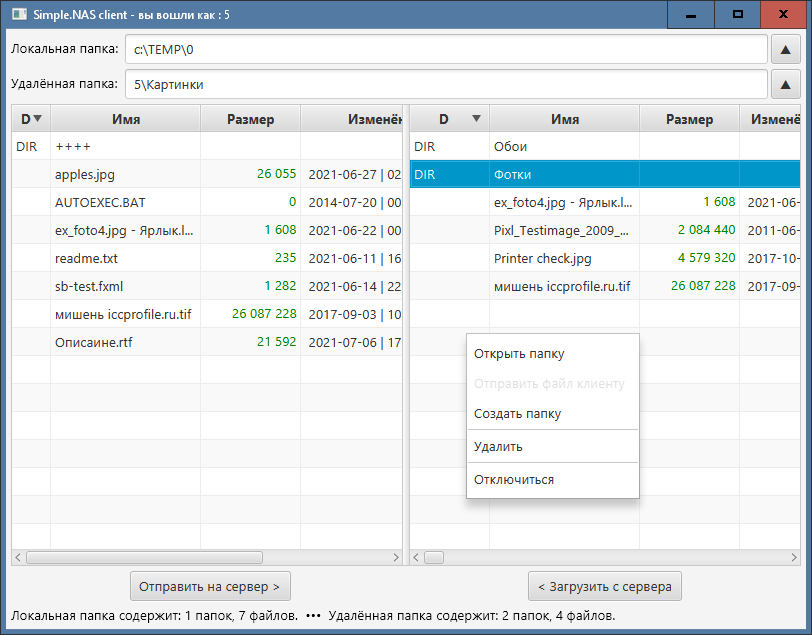

# Описание работы приложения Simple.Nas

Simple.Nas — это двухкомпонентное приложение, предоставляющее пользователям возможность хранить файлы в удалённом хранилище. Приложение состоит из серверной и клиентской частей. Серверная часть приложения (далее _сервер_) предназначена для хранения файлов пользователей. Клиентская часть приложения (далее _клиент_) предназначена для предоставления пользователю графического интерфейса для работы с файлами на сервере и на локальном ПК.

Операции, которые доступны пользователю при работе с файлами:
* загрузка файла с локального ПК на сервер,
* загрузка файла с сервера на локальный ПК,
* создание папки,
* переименование папки или файла,
* удаление файла или папки. 

Сервер при запуске ожидает подключения клиентов. При подключении клиента сервер выделяет ему канал связи. После авторизации клиента он получает доступ к файлам пользователя. Разрыв соединения происходит при закрытии клиентского приложения.

## Графический интерфейс клиента

Графический интерфейс клиента (далее GUI) реализован в виде небольшого Java-приложения. Окно приложения разделено на две панели: левая отображает выбранную пользователем локальную папку, а правая — выбранную папку на стороне сервера. При запуске GUI подключение к серверу отсутствует, и правая панель пуста.

Над панелями расположены два поля ввода, предназначенные для ввода и отображения путей к локальной и удалённой папкам. Поле ввода пути для локальной папки, как и левая панель доступны для использования сразу после запуска приложения. Поле ввода пути к удалённой папке на этом этапе занято кнопкой, нажатие на которую запускает процесс авторизации пользователя.

Если авторизация прошла успешно, поле ввода пути к удалённой папке становится доступно для редактирования и содержит относительный путь к текущей удалённой папке. В это время правая панель отображает содержимое текущей удалённой папки.

## Авторизация и удалённое дисковое пространство

Для доступа к своему дисковому пространству на сервере, пользователь должен авторизоваться. Авторизация состоит в сообщении серверу логина, состоящего из букв и цифр, и пароля. Для начала авторизации пользователь должен нажать на кнопку подключения к удалённому хранилищу, по нажатии на которую открывается диалоговое окно для ввода логина и пароля; указав логин и пароль и нажав кнопку _Авторизоваться_, пользователь запускает процедуру авторизации на сервере.

Получив от клиента логин и пароль, сервер предоставляет клиенту доступ к файлам, расположенным в папке, название которой совпадает с логином. Если такая папка не существует, то сервер создаст её и предоставит клиенту доступ к её содержимому.

Если авторизация отклонена сервером, то соединение с сервером обрывается. Возможные причины отклонения авторизации:
* пользователь использовал недопустимые символы при вводе логина. Допустимыми символами являются латинские буквы и арабские цифры;
* пользователь с указанным логином уже авторизован;
* пользователь ещё не зарегистрирован.

> ## Важно!
> В приложении не реализована возможность регистрации новых пользователей. Перед тем как получить доступ к своему дисковому пространству, пользователь уже должен быть зарегистрирован, т.е. его логин и пароль должны содержаться в базе данных сервера.

Клиент не имеет возможности выйти за пределы своего удалённого дискового пространства на сервере, но имеет полный контроль над его содержимым. Клиент имеет полный доступ к файлам и папкам, расположенным на ПК пользователя, за исключением тех из них, доступ к которым ограничен операционной системой пользователя.

## Навигация

Перемещение между папками — локальными и удалёнными — пользователь может осуществлять двумя способами: редактируя строку пути в соответствующем поле ввода, или при помощи мыши.

Для указания пути к интересующей папке в поле ввода, пользователь должен в соответствующем поле ввода отредактировать строку пути к интересующей папке и нажать ENTER.

При помощи мыши навигацию производить легче: если требуется перейти в родительскую папку, то нужно нажать кнопку с треугольником, расположенную справа от соответствующего поля ввода. Если наоборот требуется зайти в одну из папок, отображаемых в панели, то нужно сделать двойной щелчок по этой папке.

## Создание папок, удаление и переименование файлов и папок

Пользователь GUI-приложения имеет возможность создавать папки как на стороне сервера, так и на своей стороне. Для создания папки нужно правой кнопкой мыши вызвать контекстное меню и выбрать в нём соответствующий пункт.

Для переименования папки или файла нужно выделить интересующий элемент текущего каталога, правой кнопкой мыши вызвать контекстное меню и выбрать в нём соответствующий пункт. Переименование выбранного пункта текущего каталога можно начать при помощи клавиши F2. Переименование следует завершать нажатием ENTER. Для отказа от начатого переименования следует нажать ESC.

Для удаления папки или файла пользователь должен выделить соответствующий элемент текущего каталога, правой кнопкой мыши вызвать контекстное меню и выбрать пункт «Удалить». При удалении файлов и непустых папок пользователю будет предоставлена возможность подтвердить свои намерения.

> ### Внимание!
> Удаление файла или папки является необратимым процессом! Также нельзя отменить завершённое переименование файла или папки.

## Перемещение файлов

Для перемещения файла на сервер нужно выделить интересующий файл текущего локального каталога, правой кнопкой мыши вызвать контекстное меню и выбрать соответствующий пункт. Отправку файла на сервер можно также запустить кнопкой «Отправить на сервер» расположенной под левой панелью.

Аналогично производится загрузка файла с сервера, но выбирать файл нужно в правой панели. Кнопка для загрузки файла с сервера расположена под правой панелью и называется «Загрузить с сервера».

Перемещение папок и групп файлов не реализовано.

## Слежение за текущим каталогом

Поскольку клиентская часть приложения работает с файловой системой ПК пользователя, существует необходимость отслеживать изменения в текущей папке, сделанные другими приложениями или самой ОС. Эту задачу решает стандартная служба наблюдения за текущей папкой: переименование, создание и удаление элементов в текущей папке тут же отображаются в клиентской части приложения. Для серверной части такое наблюдение не реализовано.

## Управление сервером

Сервер не имеет графического интерфейса, и для управления сервером предусмотрены только консольный ввод и только одна команда — _exit_, которая служит для завершения серверной части приложения. При выполнении этой команды сервер принудительно разрывает все существующие подключения.

## Установка и удаление

Обе части приложения являются полностью портативными. Для их установки требуется только копирование файлов приложения в подходящий каталог. Для удаления достаточно удаления всех файлов программы.

## Файлы настроек

Клиентская и серверная части приложения используют XML-файлы настроек для хранения некоторых параметров. Файл настроек на сервере хранит номер публичного порта (порта, который используется для подключения клиентов), имя папки, используемой в качестве хранилища файлов пользователей, а также списки папок и файлов, которые копируются в папку нового пользователя, чтобы эта папка не выглядела для нового пользователя недружелюбно пустой.

Файл настроек клиента хранит номер порта для подключения к серверу, имя хоста сервера, последний локальный путь, используемый в предыдущей сессии, а также размер шрифта, используемого в приложении. Для авторизованного пользователя в том же файле дополнительно сохраняются:
* персональные пути к локальной и удалённой папкам;
* персональный размер шрифта приложения.

В обоих случаях файлы настроек автоматически создаются при первом запуске приложения и заполняются умолчальными значениями. После закрытия приложения файлы настроек можно отредактировать, — новые настройки вступят в силу при запуске приложения.

## База данных

Регистрационные данные пользователей хранятся в базе данных SQLite, связь с которой сервер устанавливает при запуске и поддерживает всё время работы. Сервер лишён возможности создавать БД или редактировать данные в ней. Предполагается, что добавление и изменение регистрационных данных пользователей будет выполняться «третьей стороной».
